# Chicken invaders Game

## Project info
This is a project for my computer graphics course at university of Cairo (Computer Science Faculty).

## Dependencies
* OpenGL
* Jogl
* json-simple

## Features
* SinglePlayer and Multiplayer
* Two level easy and hard 
* each level contain four stage
* Sound for each object in game
* Save high score in leader board use json file
* Handle collision between objects
* Enemy animation for each stage
* Effects for enemys and player appear for few sec when collision
* Player have health and special gift for shoot special bullet and powerUp to increase score

## Demo
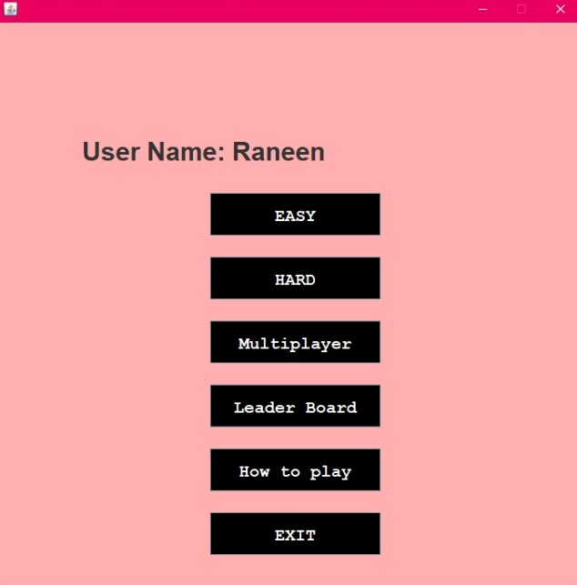
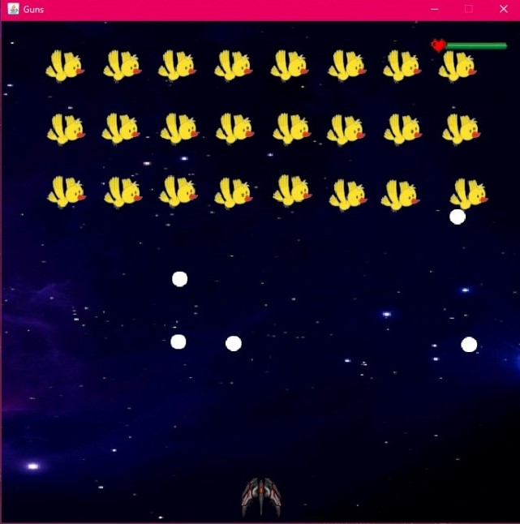
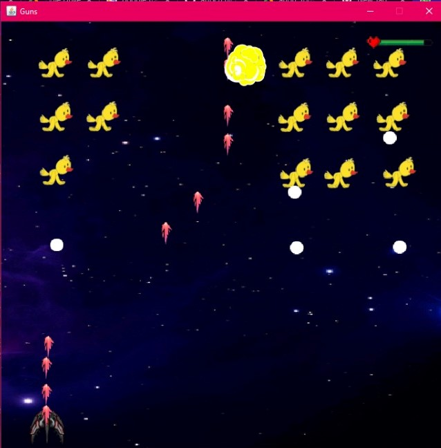
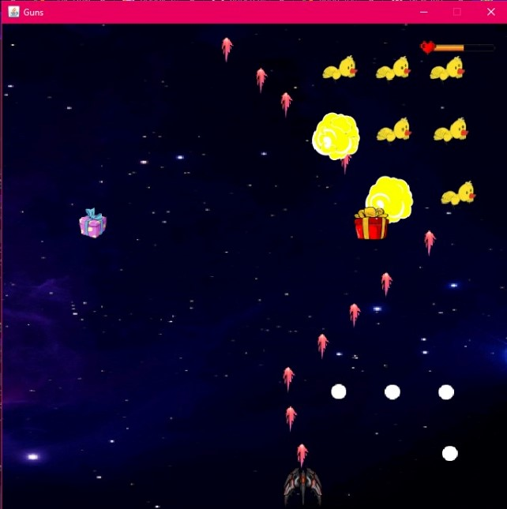
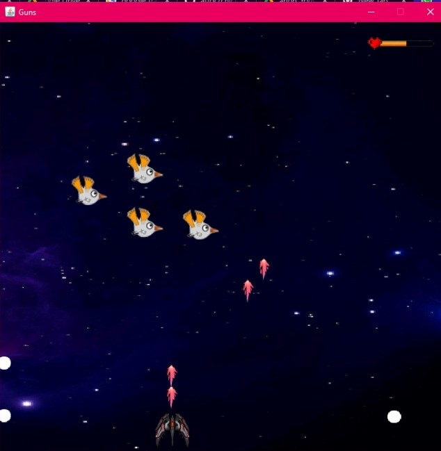
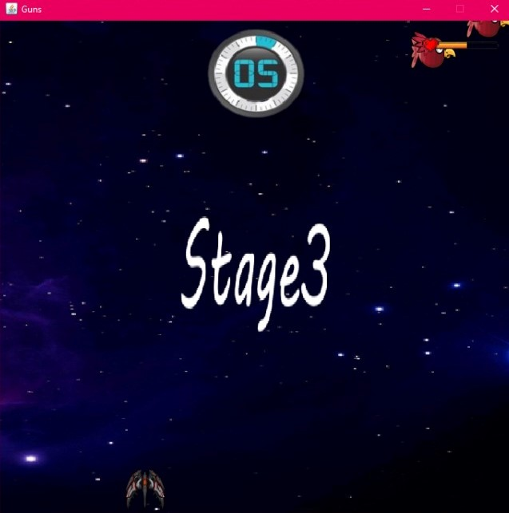
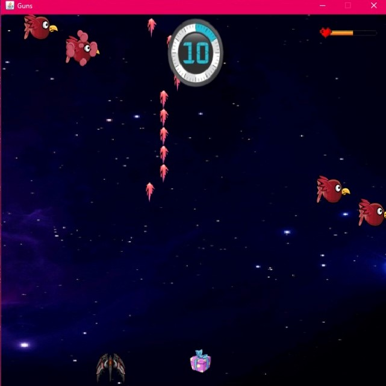
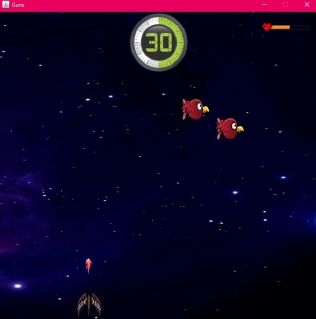
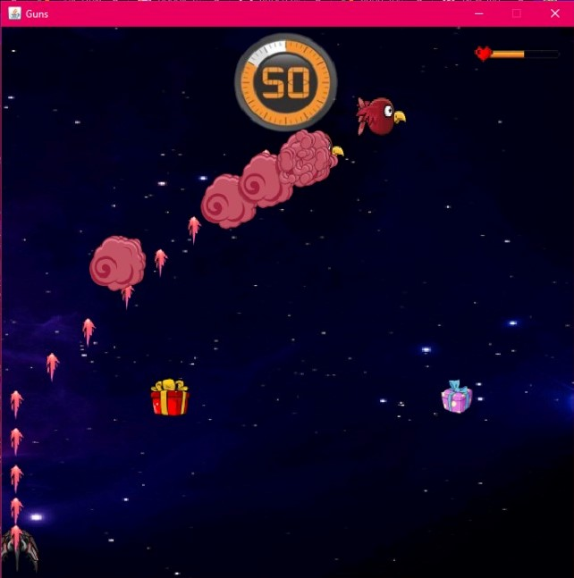
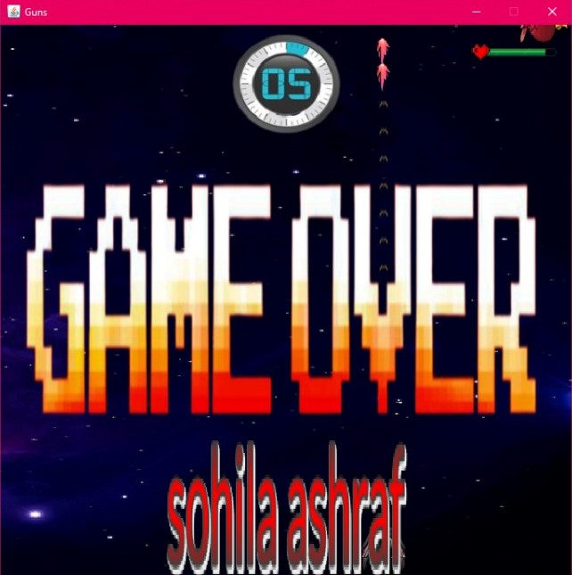
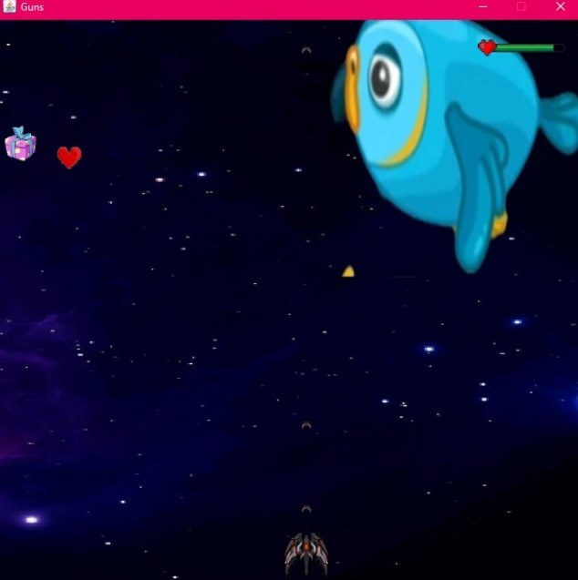
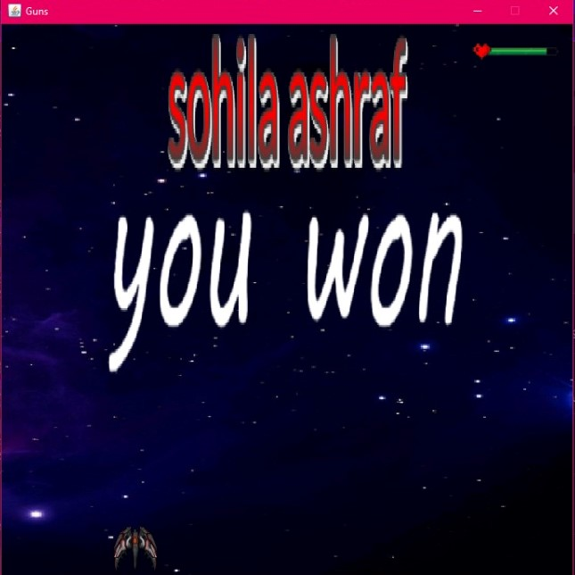
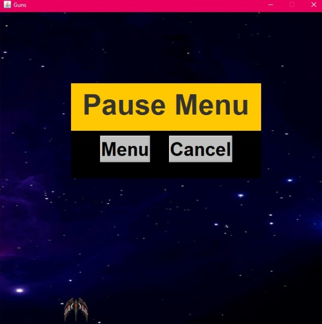
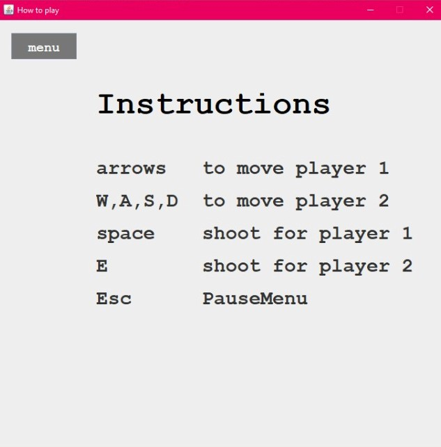
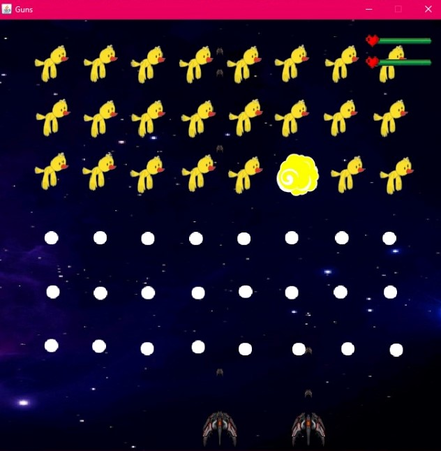
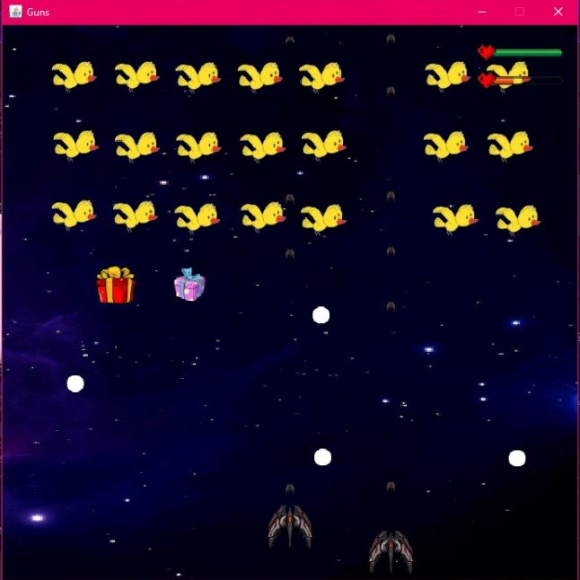
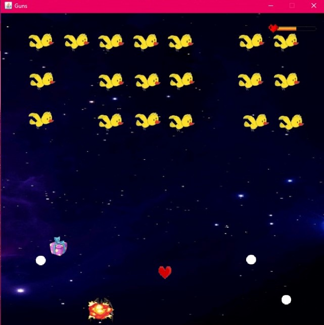

## main
This Package Contains Several Classes about General setting.

## Players.main
This Package Contains Several Classes about Players.

## Player Class
Is responsible for Draw Players and move them and Draw Player'sBullets.
>drawPlayer(GL gl, float x, float y)

> move();

Method for move FirstPlayer by keyUp keyDown keyLeft keyRight and space for Shoot;
> move2();

Method for move SecondPlayer by A_key S_key w_key D_key and E_key for Shoot
>drawPlayerBullet(GL gl, String name, boolean isPause)

Method for Draw Bullet

### Bullet Class
Is responsible for Draw Bullet.
>drawBullet(GL gl, float x, float y)

>drawFollowingBullet(GL gl, float xPlayer, float yPlayer)

This method is special for last stage ,the BossEnemy hits following bullet to kill the player.

### Collision Class
This Class Handle the Collision between any Two Object.
>collision(Object obj1, Object obj2, ArrayList<Enemy> eList)

this method can handle collision between player and enemy or between enemy and bullet or between player and health or gift or between player and egg.

### PlayerEffect Class
Is responsible for Draw Player Effect when it Hits with an Egg of Enemy, this effect appear few sec and hide.
>drawPlayerEffects(GL gl, int stage)
## Enemys.main 🐔
This Package Contains Several Classes about Enemys .
### Enemy Class
Is responsible for Create and Draw Chicken Depend on the type of Stage,
>drawEnemy(GL gl, float positionX, float positionY int stageNumber)

This function is responsible for Draw the chicken.

###EnemyAI Class
Is responsible for the way they move 
we have four different method for the motion of enemy ,each one for specific stage
> createAI01(ArrayList<Enemy> eList, GL gl, ArrayList<Player> players, ArrayList<Bullet> enemyBullets)

> createAI02(ArrayList<Enemy> eList1, GL gl, ArrayList<Player> players, ArrayList<Bullet> enemyBullets)

> createAI03(ArrayList<Enemy> eList, ArrayList<Enemy> eList2, GL gl, ArrayList<Player> players, ArrayList<Bullet> enemyBullets)

> createAI04(ArrayList<Enemy> eList, ArrayList<Enemy> eList2, GL gl, ArrayList<Player> players, ArrayList<Bullet> enemyBullets) 

### EnemyBoss Class
Is responsible for Draw Special Enemy for Last Stage (final level) and move it by random way.

###EnemyEffect Class
Is responsible for Draw Enemy Effect when it Hits with a Bullet, this effect appear few sec and hide, and we have four enemy effect depend on stage.
>drawEnemyEffects(GL gl, int stage)
